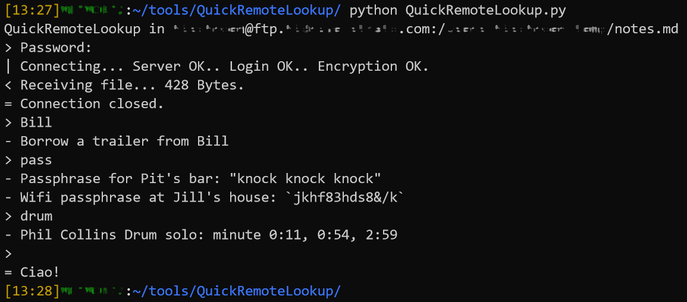

# QuickRemoteLookup
Python command line script to quickly find strings in a file on a remote (ftp) server.

## What this script does for you in a blink of a second:

1. Connects to a pre-configured FTP client,
2. loads the content of a specific file into memory (saver than downloading the file),
3. lets you search for strings, returns the matching line(s),
4. cleans all up behind you.

## Useful if:

- You have notes or sensitive information stored on your FTP server
- You need to access and search only a few lines of your notes
- You do that very often 
- You got frustrated with the normal workflow of using a standard FTP client (connect, download, open, search, delete, etc.)

## Usage

1. Call the script: `QuickRemoteLookup.py mynotes.cfg`,
2. enter ftp password to connect to the server,
3. after the file is loaded into the memory, the connection is closed,
4. type in a search string and press Enter to view all lines that match the string,
5. repeat or leave the input blank to close

## Further notes

The script opens a secure communication connection and *does not download* the file. It only loads its content into the memory. Thereby, it is more save for sensitive information. 
